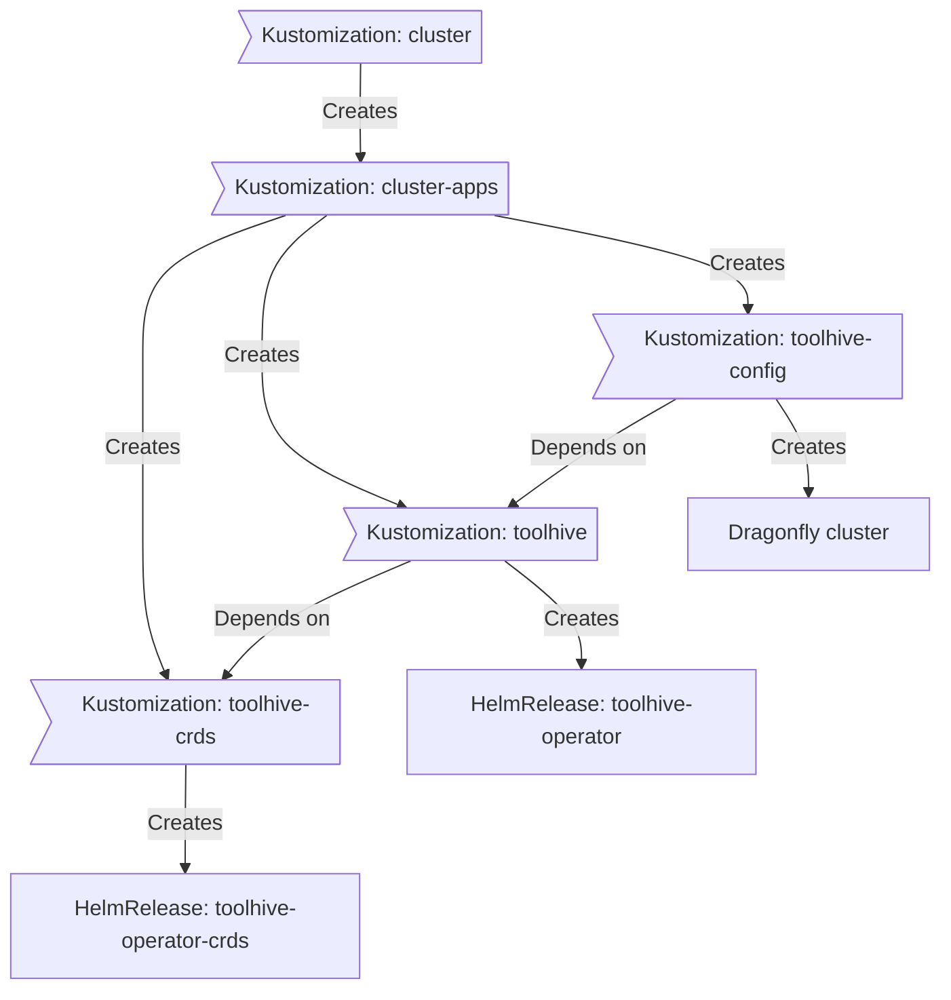

<div align="center">


### My Home Operations Repository :octocat:

_... managed with Flux, Renovate, and GitHub Actions_ 🤖

</div>

<div align="center">

[](https://discord.gg/home-operations)&nbsp;&nbsp;
[](https://talos.dev)&nbsp;&nbsp;
[](https://kubernetes.io)&nbsp;&nbsp;
[](https://fluxcd.io)&nbsp;&nbsp;


</div>


<div align="center">

[](https://status.oxygn.dev)&nbsp;&nbsp;
[](https://status.oxygn.dev/endpoints/external_echo)&nbsp;&nbsp;
[](https://status.oxygn.dev/endpoints/external_plex)

</div>

<div align="center">


[](https://github.com/kashalls/kromgo)&nbsp;&nbsp;
[](https://github.com/kashalls/kromgo)&nbsp;&nbsp;
[](https://github.com/kashalls/kromgo)&nbsp;&nbsp;
[](https://github.com/kashalls/kromgo)&nbsp;&nbsp;
[](https://github.com/kashalls/kromgo)&nbsp;&nbsp;
[](https://github.com/kashalls/kromgo)&nbsp;&nbsp;
[](https://github.com/kashalls/kromgo)

</div>

---

## 📖 Overview

This is a mono repository for my home infrastructure and Kubernetes cluster. I try to adhere to Infrastructure as Code (IaC) and GitOps practices using tools like [Talos](https://www.talos.dev/), [Kubernetes](https://kubernetes.io/), [Flux](https://github.com/fluxcd/flux2), [Renovate](https://github.com/renovatebot/renovate), and [GitHub Actions](https://github.com/features/actions).

---

## ⛵ Kubernetes

There is a template over at [onedr0p/flux-cluster-template](https://github.com/onedr0p/flux-cluster-template) if you want to try and follow along with some of the practices I use here.

### ⚙️ Installation

My cluster is a 4-node [talos](https://talos.dev/) cluster overtop VMs provisioned in a 2-nodes Proxmox VE 8 cluster: 3 control-plane nodes (`k8s-0/1/2`, semi-hyper-converged — workloads and storage share the same resources) plus 1 dedicated GPU worker node (`k8s-3`, tainted `workload=ai:NoSchedule` and reserved for AI workloads). Storage is [OpenEBS](https://openebs.io/) local-path for fast local volumes and [Miroir](https://github.com/home-operations) (DRBD-replicated) for replicated block storage, both co-located on the control-plane nodes. I also have a separate server for (NFS) file storage.

See [talos/README.md](./talos/README.md) for the Talos machine configuration and [bootstrap/README.md](./bootstrap/README.md) for the cluster bootstrap procedure.

### 🔧 Core Components

- [actions-runner-controller](https://github.com/actions/actions-runner-controller): self-hosted Github runners
- [cert-manager](https://cert-manager.io/docs/): creates SSL certificates for services in my cluster
- [cilium](https://github.com/cilium/cilium): internal Kubernetes networking plugin (eBPF, BGP, L2 announcements)
- [cloudflared](https://github.com/cloudflare/cloudflared): Enables Cloudflare secure access to certain routes.
- [cloudnative-pg](https://github.com/cloudnative-pg/cloudnative-pg): Postgres operator, default database for apps (see [components/postgres](./kubernetes/components/postgres/README.md))
- [envoy-gateway](https://github.com/envoyproxy/gateway): L7 ingress via Gateway API (`envoy-internal` / `envoy-external`)
- [external-dns](https://github.com/kubernetes-sigs/external-dns): automatically syncs DNS records from my cluster routes to a DNS provider
- [external-secrets](https://github.com/external-secrets/external-secrets): Managed Kubernetes secrets using [1Password Connect](https://developer.1password.com/docs/connect/).
- `kopiur`: backup and recovery of persistent volume claims (volsync fork, Kopia backend over NFS — see [components/kopiur](./kubernetes/components/kopiur/README.md))
- `miroir`: DRBD-replicated block storage (`miroir-slow` storage class)
- [openebs](https://github.com/openebs/openebs): local-path host storage for fast ephemeral volumes
- [spegel](https://github.com/spegel-org/spegel): Stateless cluster local OCI registry mirror.

### 🤖 GitOps

[Flux](https://github.com/fluxcd/flux2) is installed by the `flux-operator` / `flux-instance` Helm releases during bootstrap. A single root Flux `Kustomization` ([`cluster-apps`](./kubernetes/flux/cluster/ks.yaml)) watches the `kubernetes/apps` folder and recursively builds every `kustomization.yaml` it finds — one namespace per directory, one Flux `Kustomization` per app (`ks.yaml`), and under each app path a `HelmRelease` (or raw resources) plus its `OCIRepository` chart source. The root `Kustomization` injects cluster-wide defaults into all children (deletion policy, HelmRelease install/upgrade/rollback strategies) via patches.

Shared, reusable patterns live in [kubernetes/components](./kubernetes/components/) (Postgres, Dragonfly cache, PVC backups, alerts, scale-to-zero) and are referenced from an app's `ks.yaml` via the `components:` field. Each component has its own README.

[Renovate](https://github.com/renovatebot/renovate) watches my **entire** repository looking for dependency updates, when they are found a PR is automatically created. When some PRs are merged [Flux](https://github.com/fluxcd/flux2) applies the changes to my cluster.


### Directories

This Git repository is structured as follows:

```sh
📁 .github             # GitHub workflows (PR automation, labels, codeql)
📁 bootstrap           # one-time cluster bootstrap (helmfile + kustomize)
📁 kubernetes
├── 📁 apps            # applications (one directory per namespace)
├── 📁 components      # reusable kustomize components
├── 📁 flux            # root Flux Kustomization
└── 📜 mod.just        # day-2 kubernetes just recipes
📁 talos               # Talos Linux machine configurations
```

### Flux Workflow

This is a high-level look how Flux deploys applications with dependencies, using the real `toolhive` chain: the CRDs must be healthy before the operator, and the operator before the config (which brings its Dragonfly cache).



---

## 🌐 DNS

In my cluster there are two instances of [ExternalDNS](https://github.com/kubernetes-sigs/external-dns) running. One for syncing private DNS records to my `UDM Pro` using [ExternalDNS webhook provider for UniFi](https://github.com/kashalls/external-dns-unifi-webhook), while another instance syncs public DNS to `Cloudflare`. This setup is managed by creating routes with two specific classes: `envoy-internal` for private DNS and `envoy-external` for public DNS. The `external-dns` instances then syncs the DNS records to their respective platforms accordingly.

---

## 🤝 Gratitude and Thanks

Thanks to all the people who donate their time to the [Home Operations](https://discord.gg/home-operations) Discord community. A lot of inspiration for my cluster comes from the people who have shared their clusters using the [kubesearch](https://github.com/topics/kubesearch) GitHub topic. Be sure to check out [kubesearch.dev](https://kubesearch.dev/) for ideas on how to deploy applications or get ideas on what you can deploy.

---

## 📜 Changelog

See [commit history](https://github.com/OxygnCorp/home-ops/commits/main)
